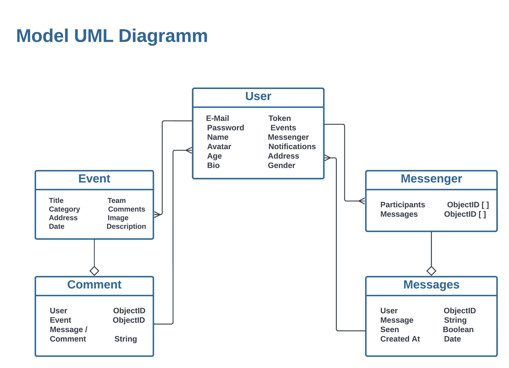

# Axios-App

Open [Axios App](https://axios-events.onrender.com) to view the app in your browser.

# Project Overview
The Events App is a dynamic and user-friendly web application designed to connect people with exciting events, whether they're organizers looking to create memorable experiences or attendees seeking the perfect event to join. This platform serves as a hub for event creation, registration, and seamless communication among event-goers.

## Model UML Diagram

## Key Features
User Registration and Authentication: Users can easily create accounts, log in, and manage their profiles securely. Account registration provides a personalized experience, allowing users to keep track of their event history and activity.

Event Creation: Organizers have the power to create and manage events effortlessly. They can provide event details such as the event name, date, time, location, description, and even set up ticketing options if needed.

Event Discovery: Attendees can explore a diverse range of events based on their interests, location, and preferences. Our advanced search and filtering options make it a breeze to find the perfect event for any occasion.

Event Registration: Users can quickly register for events they're interested in attending. Registration can involve purchasing tickets or simply expressing interest, depending on the event organizer's preferences.

Event Chat: A real-time chat feature enables attendees to communicate with each other and with event organizers. This fosters a sense of community and helps attendees coordinate plans and share experiences.

Notifications: Users receive timely notifications about event updates, messages, and important information related to their registered events.

User-friendly Interface: The application offers an intuitive and aesthetically pleasing user interface, ensuring a seamless and enjoyable user experience.

Privacy and Security: We prioritize the security of user data and use robust authentication and authorization mechanisms to protect user accounts and event information.

## Purpose
The Events App was created with the aim of making event planning, discovery, and interaction more accessible and enjoyable for everyone. Whether you're hosting a local meetup, a concert, a conference, or simply looking for fun activities in your area, our platform brings together organizers and attendees in one unified space.

## My project is to provide a platform that:

Empowers event organizers to reach a broader audience and efficiently manage their events.
Enables users to discover, participate in, and connect with a wide array of events.
Fosters a vibrant community by facilitating communication and interaction among event-goers.
